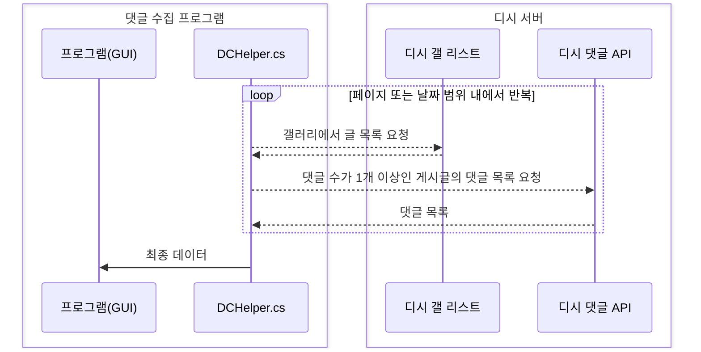

# 디시인사이드 댓글 랭킹
디시인사이드 갤러리의 특정 기간 또는 특정 페이지 범위 내에서 댓글을 많이 단 이상한 사람들의 순위를 텍스트 파일로 저장할 수 있습니다.
이 프로그램을 이용하여 발생하는 문제는 모두 사용자에게 있으므로 주의하십시오.

요구사항 : .Net Framework 4.7.2

p.s. 고3이 하라는 공부는 안하고 프로그램 제작하고있슴... 

# [프로그램 다운로드](https://github.com/OFox213/DCRanking/releases) 
유저 인터페이스 적용으로 쉬운 사용
페이지 또는 날짜 범위로 댓글 수 수집
수집된 데이터를 텍스트 파일로 저장(순위, 닉네임 또는 IP, 댓글 수 등)

# 사용 방법

1. 갤러리 ID를 입력합니다.
(https://gall.dcinside.com/board/lists/?id=이 부분이 아이디)

2. 시작과 끝 페이지를 설정합니다.

3. 시작과 끝 날짜를 설정합니다.
- 시작과 끝 날짜가 같고 시작과 끝 페이지 숫자만 입력하는 경우 설정한 페이지 범위 내에서 댓글 수를 집계합니다.
- 시작과 끝 날짜가 다르고 시작 페이지 숫자만 입력하는 경우 시작 페이지부터 지정한 날짜 범위 내의 댓글 수를 집계합니다.
- 시작과 끝 날짜가 다르고 시작과 끝 페이지 숫자를 입력하는 경우 시작 페이지부터 끝 페이지 범위와 설정 날짜 범위 내의 댓글 수를 집계합니다.

4. 데이터 불러오기를 눌러 1~3과정을 마친 후의 데이터 파일을 선택해주세요.
5. 데이터가 불러와진 후 왼쪽 리스트에서 확인 후 '파일 저장' 을 눌러주세요.

6. 각 값을 설정 후 저장 버튼을 눌러 저장합니다. 이때 프로그램과 같은 폴더 내에 results 에 텍스트 파일로 저장됩니다.

# Features
더 정확하게 고닉들의 댓글 수를 집계할 뿐만 아니라 댓글 내용까지 수집하는(...) 강력한 디시 댓글 랭킹 프로그램입니다.
댓글 내용까지 수집하려면 '디버그' 탭에서 유저 댓글 내용 기록을 활성화하고 대상 유저 닉네임을 정확하게 입력하여 저장한 후 집계하면 됩니다.

# DCHelper.cs PoC
디시 갤 목록의 분석과 response-comment api 를 이용하여 작성자가 단 댓글의 수를 정확하게 집계할 수 있도록 구현하였습니다.
프로그램과 그에 맞는 전용 DCHelper 모듈을 작성하여 아래 다이어그램의 원리로 작동합니다.

그런데 다른 사람이 보기에 이런게 필요한가??
프로그램과 소스코드 라이선스는 귀찮으니 MIT로 합시다.

# Others...
사용 라이브러리 
- Newtonsoft.JSON
- HtmlAgilityPack

참고 프로젝트
dcinisde-crawler.ver.2 (by hanel2527)
